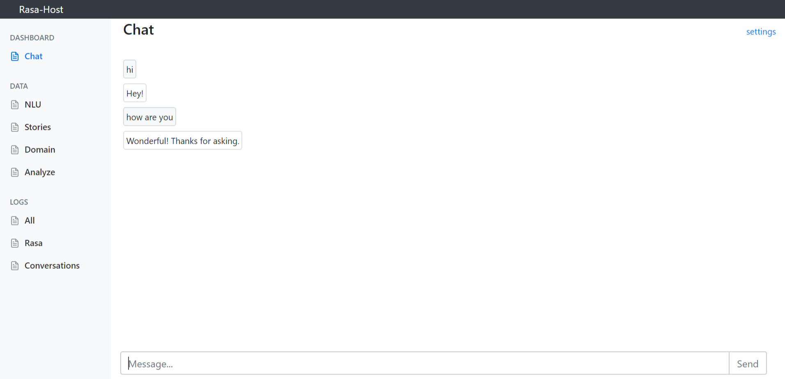
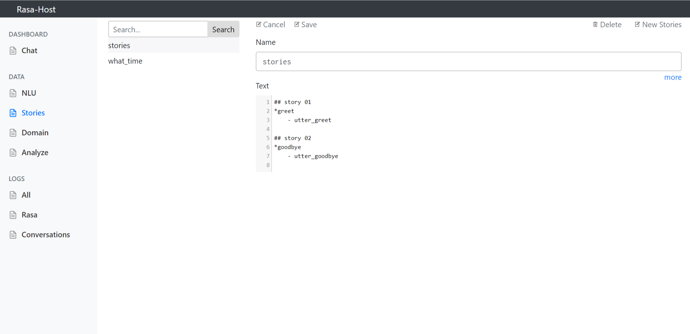
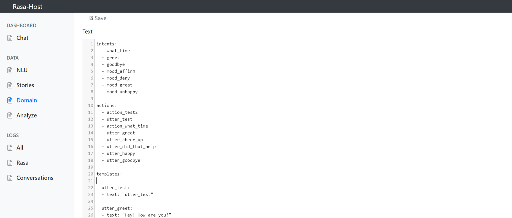
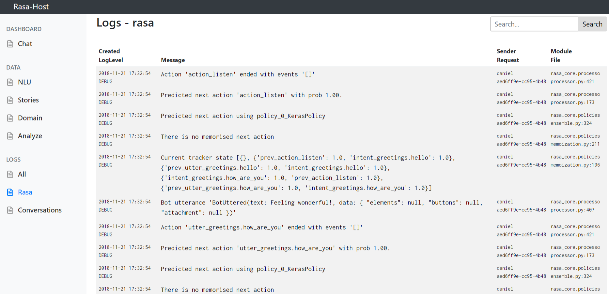
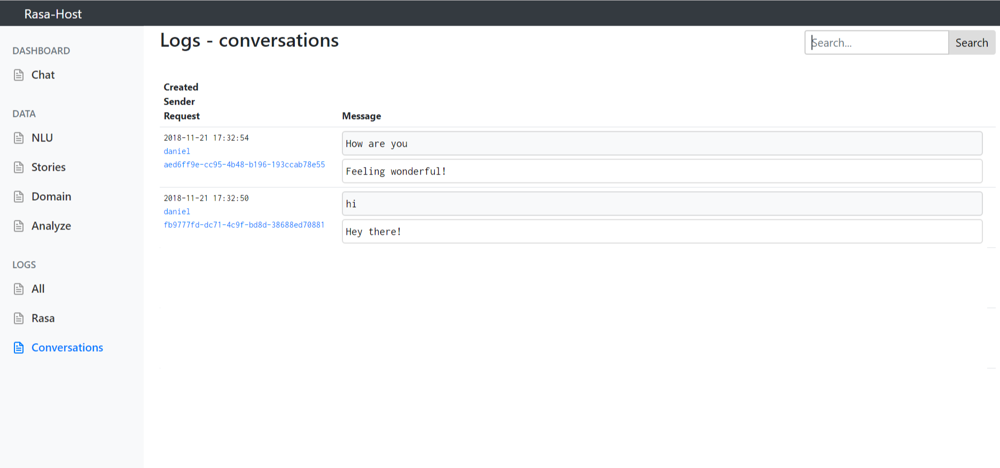

# RasaHost

ui and host for Rasa Nlu and Rasa Core

```python
#  #rasa-host.endpoints.yml
#  action_endpoint:
#  url: "http://localhost:5005/actions"
action_endpoint_conf = utils.read_endpoint_config("rasa-host.endpoints.yml", endpoint_type="action_endpoint")
interpreter = RasaNLUInterpreter('models/current/nlu')
agent = Agent.load("models/current/dialogue", interpreter=interpreter, action_endpoint=action_endpoint_conf)

actionExecutor = ActionExecutor()
actionExecutor.register_package('actions')

from RasaHost import host
host.set_data_path("path_to_directory_with_data")
host.agent = agent
host.actionExecutor = actionExecutor
if __name__ == '__main__':    
    host.run()
    # werkzeug  -  * Running on http://0.0.0.0:5005/ (Press CTRL+C to quit)
```













