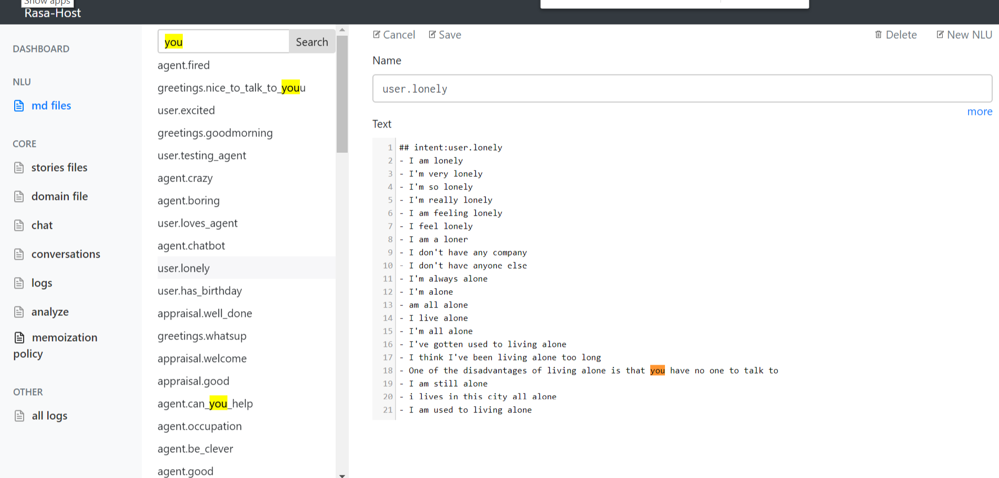
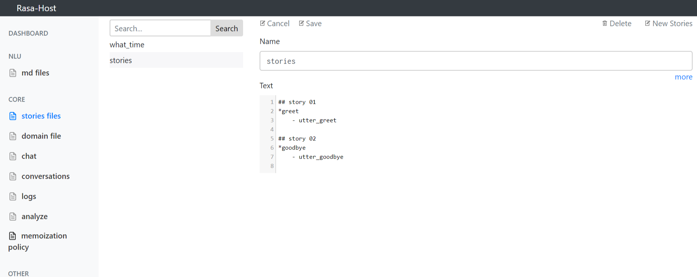
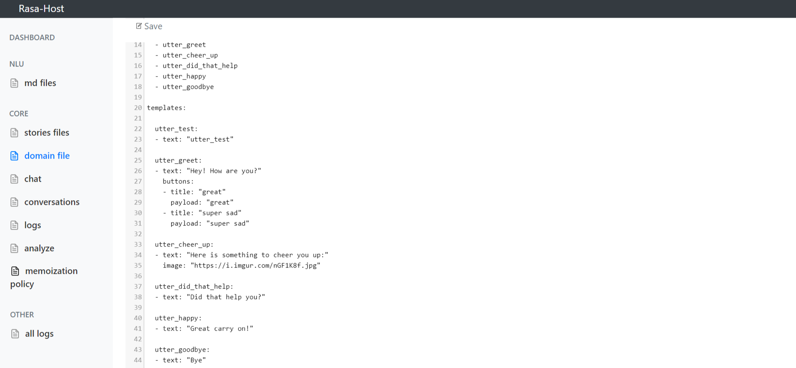
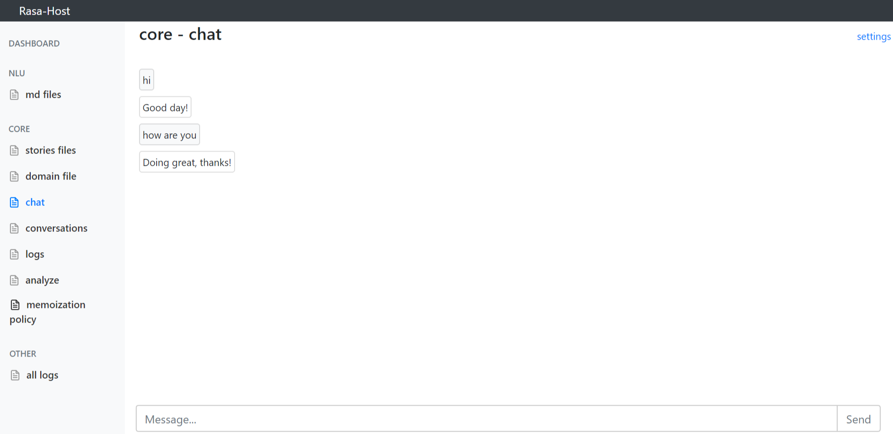
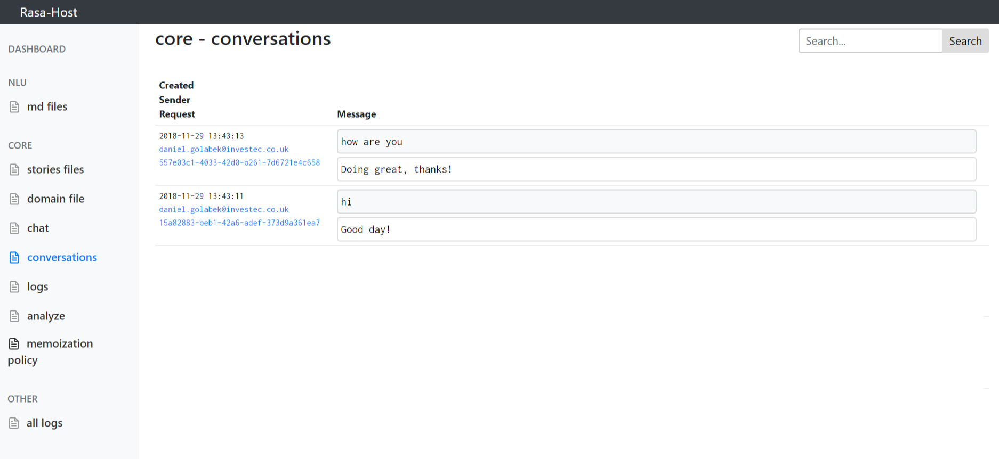
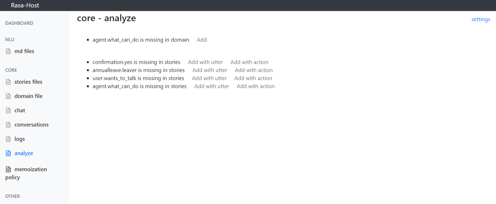
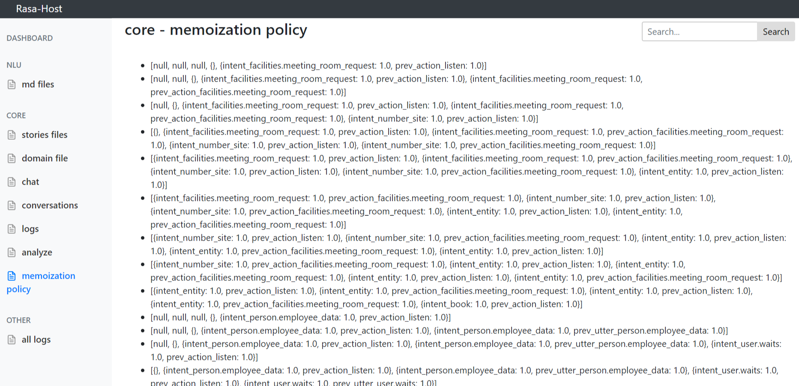

# RasaHost

User interface for Rasa NLU and Rasa Core, that simplify bot development.

### Features
- Editor for md files (intents, sotries, domain) in Rasa format
  - Getting started is beyond easy, you just have to specify paths to your md files. 
  - No migration is needed. The tool uses standard Rasa format.
  - Does not have dependency on Rasa version.
- Logs conversations
  - All logs and conversations are saved in SQLite.
  - You just have to create and agent and bind it to the host.
  - The logging can be mixed with standar logging to files and console, like Rasa does by default.
  - Does not have dependency on Rasa version.
- Testing
  - Chat control
  - Memoization Policy visualization

### Tech
- python
- flask
- vuejs

### Installation
[https://pypi.org/project/rasa-host](https://pypi.org/project/rasa-host/)
```python
pip install rasa-host
```


### Running
Rasa-Hot does not have dependency on Rasa(in fact does not have Rasa packages dependency) and will work with all version.
```python
from rasa_core.interpreter import RasaNLUInterpreter
from rasa_core.agent import Agent
interpreter = RasaNLUInterpreter('models/current/nlu')
agent = Agent.load("models/current/dialogue", interpreter=interpreter)

from RasaHost import host
host.nlu_path = os.path.join(current_dir, "data/nlu/")
host.stories_path = os.path.join(current_dir, "data/stories/")
host.domain_path = os.path.join(current_dir, "data/domain.yml")
host.agent = agent
if __name__ == '__main__':    
    host.run()
    # werkzeug  -  * Running on http://0.0.0.0:5005/ (Press CTRL+C to quit)
    
    # GET http://localhost:5005/conversations/daniel/respond?q={{message}}
```


## NLU - md files
```python
from RasaHost import host
host.nlu_path = os.path.join(current_dir, "data/nlu/")
if __name__ == '__main__':    
    host.run()
```


## Core - stories files
```python
from RasaHost import host
host.stories_path = os.path.join(current_dir, "data/stories/")
if __name__ == '__main__':    
    host.run()
```


## Core - domain file
```python
from RasaHost import host
host.domain_path = os.path.join(current_dir, "data/domain.yml")
if __name__ == '__main__':    
    host.run()
```


## Core - chat
Chat interface for testing Rasa. By default, does GET http://{{host}}/conversations/{{sender_id}}/respond?q={{message}}
```python
from RasaHost import host
host.agent = agent
if __name__ == '__main__':    
    host.run()
```


## Core - conversations
Conversations are saved in SQLite.
```python
from RasaHost import host
host.agent = agent
if __name__ == '__main__':    
    host.run()
```


## Core - logs
Logs are saved in SQLite.
```python
from RasaHost import host
host.agent = agent
if __name__ == '__main__':    
    host.run()
```


## Core - analyze
Analyze intents, stories and domain. Shows warnings and suggestions.
```python
from RasaHost import host
host.nlu_path = os.path.join(current_dir, "data/nlu/")
host.stories_path = os.path.join(current_dir, "data/stories/")
host.domain_path = os.path.join(current_dir, "data/domain.yml")
if __name__ == '__main__':    
    host.run()
```


## Core - memoization policy
Decode memoization policy data.
```python
from RasaHost import host
host.memoization_policy_path = os.path.join(current_dir, "models\current\dialogue\policy_1_MemoizationPolicy")
if __name__ == '__main__':    
    host.run()
```


## Actions
You can also host actions, with or without agent.
```python
from rasa_core_sdk.executor import ActionExecutor
actionExecutor = ActionExecutor()
actionExecutor.register_package('actions')

from RasaHost import host
host.actionExecutor = actionExecutor
if __name__ == '__main__':    
    host.run()
    # werkzeug  -  * Running on http://0.0.0.0:5005/ (Press CTRL+C to quit)
    # POST http://localhost:5005/actions
```

## Agent with actions
Example of running the app with angent and custom actions.
```python
from rasa_core.interpreter import RasaNLUInterpreter
from rasa_core.agent import Agent
from rasa_core import utils, server
from rasa_core_sdk.executor import ActionExecutor
#  #rasa-host.endpoints.yml
#  action_endpoint:
#  url: "http://localhost:5005/actions"
action_endpoint_conf = utils.read_endpoint_config("rasa-host.endpoints.yml", endpoint_type="action_endpoint")
interpreter = RasaNLUInterpreter('models/current/nlu')
agent = Agent.load("models/current/dialogue", interpreter=interpreter, action_endpoint=action_endpoint_conf)

actionExecutor = ActionExecutor()
actionExecutor.register_package('actions')

from RasaHost import host
host.set_data_path("path_to_directory_with_data")
host.agent = agent
host.actionExecutor = actionExecutor
if __name__ == '__main__':    
    host.run()
    # werkzeug  -  * Running on http://0.0.0.0:5005/ (Press CTRL+C to quit)
    
    # GET http://localhost:5005/conversations/daniel/respond?q={{message}}
    # POST http://localhost:5005/actions
```

## Channels
Supports channels. All the conversations will be logged.
```python
from rasa_core.channels.botframework import BotFrameworkInput
input_channel = BotFrameworkInput(
        app_id="",
        app_password=""
)

from RasaHost import host
host.agent = agent
host.channels = [input_channel]
if __name__ == '__main__':    
    host.run()
```


